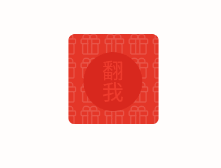

## 示例效果
<br/>
## 实现步骤
### 1.准备2张图片，一个在上一个在下
### 2.上方的图片不动，下方的图片先翻转180°,并隐藏
### 3.记录上方与下方图片的起始角度,上方起始角度为0,下方起始角度为180°
### 4.使用定时器累加角度,两张图片同时翻转
### 5.当上方的图片翻转到90度时,隐藏该图片,显示下方图片
### 6.当上方图片翻转到180度时,停止定时器,并还原记录的起始角度
### 7.第二次翻转,正反面角色互转即可
## 使用说明
```
  <!--引入js文件-->
  <script src="turn-card.js"></script>
  <script>
    // ...获取两张图片后调用该方法
    turnCardAnimate(up,down);
  </script>
   ```
## 核心代码
```
/**
 * 翻翻卡动画
 * @param up 在上的图片
 * @param down 在下的图片
 */
function turnCardAnimate(up,down) {

    if (turnCardAnimate.isTurned){ // 已经旋转过,将两个对象互转
        // 取反
        var temp = up;
        up = down;
        down = temp;
    }


    var upDeg = 0; // 上面图片起始角度
    var downDeg = 180; // 下面图片起始角度
    down.style.display = 'none'; // 隐藏下面的图片
    down.style.transform = 'perspective(1000px) rotateY('+downDeg+'deg)'; // 将下面的图片翻转180°

    main.timer = setInterval(function () {

        // 翻转每次加1度
        upDeg += 1;
        downDeg += 1;

        // 同时翻转2张图片
        up.style.transform = 'perspective(1000px) rotateY('+upDeg+'deg)';
        down.style.transform = 'perspective(1000px) rotateY('+downDeg+'deg)';

        // 当上面的图片翻转到90度,隐藏上面,显示下面的图片
        if(upDeg >= 90){
            up.style.display = 'none';
            down.style.display = 'block';
        }

        // 当上面的图片翻转到180度,初始化设置,清除定时器,并记录是否旋转
        if (upDeg >= 180){
            clearInterval(main.timer);
            downDeg = 180;
            upDeg = 0;
            animateOver = false;
            turnCardAnimate.isTurned = !turnCardAnimate.isTurned;
        }
    },2);
}
```